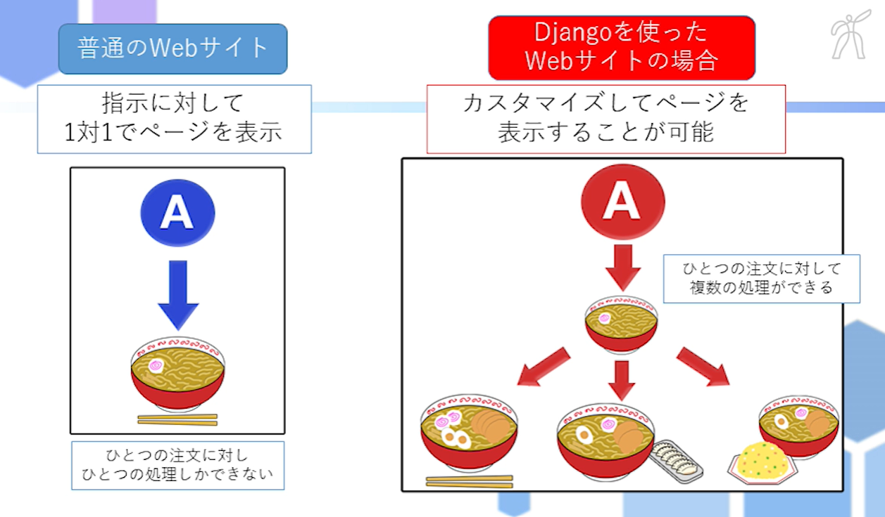
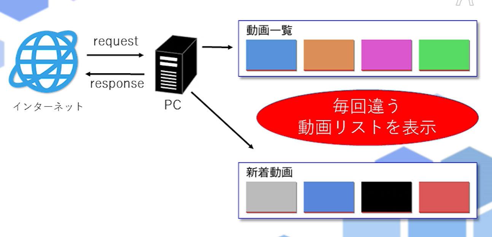
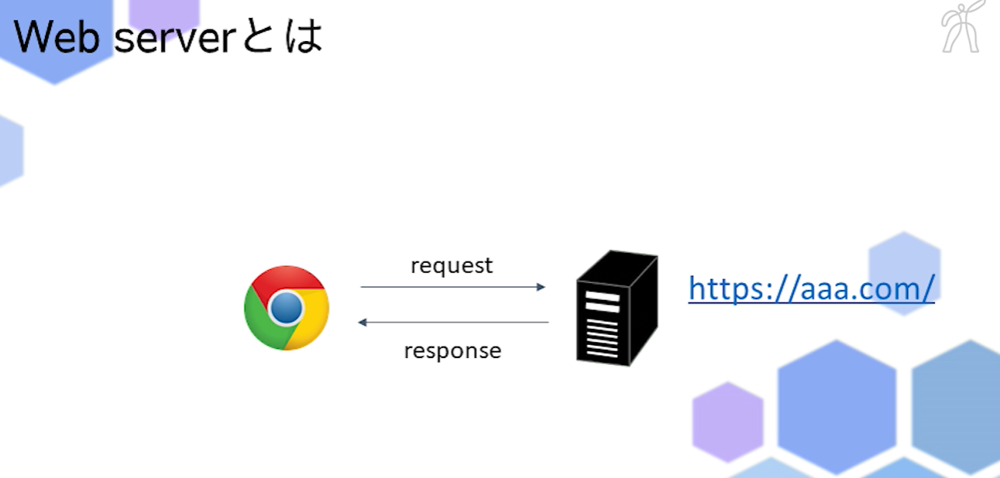

#Python応用講座のまとめ


- Django(ジャンゴ)

Django:Webアプリケーションを効率的に作るためのフレームワーク
       Djangoを使用することで効率的に作成できる。

Webアプリ：**Web**+**アプリケーション**
　　　　　 ブラウザー上で動かすアプリケーション
           Web上で行われるサービス
           例)Twitter、Facebook、Instagramなど

アプリケーション：目的に応じて使う専用プログラム、ソフトのこと
　　　　　　　　　
フレームワーク：Web アプリケーションを効率よく制作するための仕組み
　　　　　　　　ユーザに合わせてそれぞれカスタマイズしたページを表示することが出来る
　　　　　　　　例)Flask

Djangoの有無：有りの場合は、カスタマイズしてページを表示できる。
              1つの質問に対して、複数のresponseができる。
　　　　　　　無しの場合は、1つの質問に対して、1つしかresponseできない。



Django無し 例)youtube
チャンネル登録をした動画を新着動画にする場合は、Djangoを使わないと
新しいページを1個1個作成しないと対応できない。



---

- 開発環境

開発環境の構築：

pip3 install モジュール名


[aptコマンド](https://qiita.com/SUZUKI_Masaya/items/1fd9489e631c78e5b007)


```
python3 -m venv "ファイル名"
sudo apt-get install pyrhon3-venv
```

rm -rf venv　フォルダー削除

source　ファイル名
ファイル実行

source venv/bin/activate

exit()

pip install django==3.2

---

Django-admin

python3 manage.py runserver

---

サーバー:利用者の要求（リクエスト）に対して、それに応答したデータを提供するコンピュータやプログラムのこと

ブラウザーからrequestを受け取って⇔responsを返す




---

- おみくじアプリ


