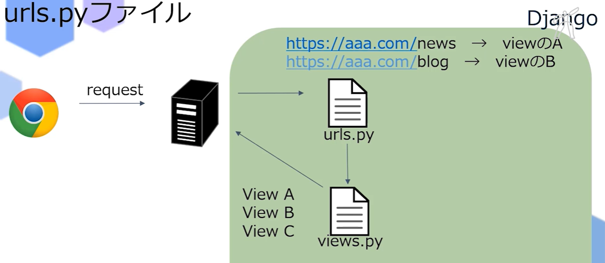

#Python応用講座のまとめ


- Django(ジャンゴ)

Django:Webアプリケーションを効率的に作るためのフレームワーク
       Djangoを使用することで効率的に作成できる。

Webアプリ：**Web**+**アプリケーション**
　　　　　 ブラウザー上で動かすアプリケーション
           Web上で行われるサービス
           例)Twitter、Facebook、Instagramなど

アプリケーション：目的に応じて使う専用プログラム、ソフトのこと
　　　　　　　　　
フレームワーク：Web アプリケーションを効率よく制作するための仕組み
　　　　　　　　ユーザに合わせてそれぞれカスタマイズしたページを表示することが出来る
　　　　　　　　例)Flask

Djangoの有無：有りの場合は、カスタマイズしてページを表示できる。
              1つの質問に対して、複数のresponseができる。
　　　　　　　無しの場合は、1つの質問に対して、1つしかresponseできない。


Django無し 例)youtube
チャンネル登録をした動画を新着動画にする場合は、Djangoを使わないと
新しいページを1個1個作成しないと対応できない。


---

- 開発環境

開発環境の構築：

インストール方法
pip3 install "モジュール名"
<br>

[aptコマンド](https://qiita.com/SUZUKI_Masaya/items/1fd9489e631c78e5b007)
<br>

仮想環境構築
```
python3 -m venv "ファイル名"
sudo apt-get install pyrhon3-venv
```
<br>

venv:
venvとは、Pythonの標準の言語処理系が持つ機能の一つで
システム上にPythonが動作する仮想的な環境（virtual environment）を作り出すもの。 
同じシステム上に複数の独立した環境を構成して使い分けることができる。

<br>

rm -rf venv　フォルダー削除
<br>

ファイル実行:
source　ファイル名

仮想環境立ち上げ
```
source venv/bin/activate
```

exit()

djangoインストール:
```
pip install django==3.2
```

<br>

Django管理者権限：
django-admin

webサーバー作成：
```
python3 manage.py runserver
```

sudo apt update

<br>
<br>
サーバー:利用者の要求（リクエスト）に対して、それに応答したデータを提供するコンピュータやプログラムのこと

ブラウザーからrequestを受け取って⇔responsを返す


asigi.py　wsgi.py
Djangoの中継的役割
間に入って処理を行ってくれる


settingus.py
初期設定、細かい設定を行うファイル


urls.py
reqestを受けた後の処理
どのviewをresponsするか処理する




---


views.py
```python
from django.http import HttpResponse
from random import choice

def index(request):
    
    omikuji = ["大吉","中吉","小吉","凶"]
    
    result = choice(omikuji)
    
    responseobject = HttpResponse(result)
    return responseobject

```

urls.py　実装:
オブジェクト
Httpresponsが返ってくるか
クラスが返ってくるか


アプリ作成
```
python3 manege.py startapp(引数) "ファイル名"
```


プロジェクトとアプリの繋ぎこみ

アプリ urls.py
```python
from django.urls import path

from . import views

urlpatterns = [
    path('kuji/', views.index),
]
```

オブジェクト urls.py
```python
from django.contrib import admin
from django.urls import path, include


urlpatterns = [
    path('kanri/', admin.site.urls),
    path('omi/', include('omikuji.urls')),
]
```

新しく作成したアプリを認識させる
```python
INSTALLED_APPS = [
        'omikui.apps.OmikujiConfig'
]
```
