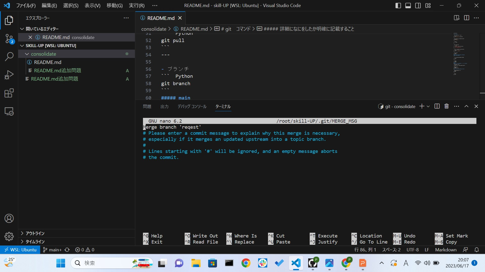
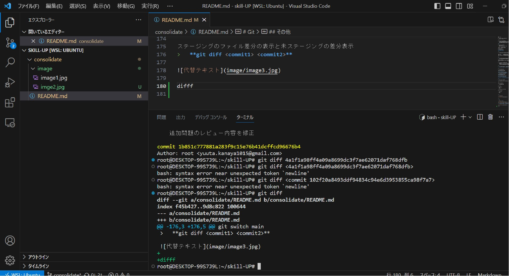

# Git

## GitHub、Gitについて

- GitHub
 >Gitのソフトウェア開発をサポートするWEBサービス

- Git
 >開発をサポートするソフトウェア
  変更履歴を追えたりなど有能！

## git comand　リスト

| コマンド内容 　　　　　　　        | comand                |詳細など             |
|-----------------------------------|----------------------|----------------------|
|ディレクトリ作成                    |mkdir "ディレクトリ名" |mkdir = make directory|
|ディレクトリの中にファイルを作成する |touch "ファイル名"     ||
|ファイル一覧                        |ls                     |ls -a 全てのファイル、ディレクトリが表示される|
|ディレクトリの移動                  |cd "パス名"             |cd .. [1つ前のディレクトリに戻る] <br>cd = change directory|
|ブランチ作成                        |git branch "ブランチ名"|branch = 枝、別々の時間軸分岐(枝分かれ)させる事で別々のバージョンを開発・管理できる。|
|ブランチの切り替え                  |git checkout "ブランチ名"|git switch "ブランチ名"|
|ステータス確認                      |git status               |--月--日--時--分に誰がどんな変更を行ったか確認できる|
|リモートリポジトリから最新の変更を取得|git pull                ||
|gitのステージングに指定したディレクトリ・ファイルに追加する      |git add "パス名"|add = 追加|
|コミット                            |git commit -m "詳細"     |詳細になにをしたか明確に記載すること|
|コミット内容をアップロード           |git push                 ||
|ログの確認                          |git log                   ||

## その他

- コミット
>git commit -am "詳細"
 am = add + -m　が合わさったもの

<br>

- リモートのmainブランチからpullする場合
> git pull origin main
  pull = 引っ張る
  リモートリポジトリから持ってくるてきな

<br>

- リモートのmainブランチからpullする
> git pull origin main

<br>

- ブランチ作成　別コマンド
>git switch -c "ブランチ名"
  c = create

---

##追加問題

Q　コミットログを1行づつ表示する
>　git log --oneline

<br>

Q　git cherry-pickについて
>　複数のブランチで作業をし、特定のブランチを
　 コミットしたい場合に使用するコマンド・
　 特定のコミットを指定して、取り込むことができる。

<br>
　
Q　merge(マージ)とは？
>　merge = 統合
   異なるブランチを統合する事。

>theirs = mergeするbranch
 ours   = mergeされるbranch

A=theirs B=ours
A+B=Aでいいのかな？

**git merge branch**

<br>

Q　pushしていない状態で間違えてコミットしてしまったときの戻し方

```
 git status　    = プッシュ状態の確認
 git log 　　    = コミット履歴を確認
 git reset HEAD~ = 直近のコミットを取り消す

```
<br>

Q  特定のコミットを元に戻す（なかったこと）にする方法
>  git revert "コミットのハッシュ値"

revert = 元に戻す
コミットのハッシュ値＝"commit 5a0be8b1d3961b2ab6c3a5c7f121a59909055dfa"

<br>

Q  なぜgit push -fはいけないのか
>  git push -f 
   強制的にリモートリポジトリに修正をプッシュするためのコマンド。
   行うと、履歴の書き換え、データの損失する可能性あり。
   
<br>

Q  ステージングのファイル差分の表示と未ステージングの差分表示
>   **git diff <commit1> <commit2>**

<br>

Q  git addの取り消し

>全てのファイルを取り消し
**git rm --cached -r**

>特定のファイルのみを取り消し
**git rm --cached -r ファイル名**

- 2回目以降git addを取り消す
>全てのファイルを取り消し
**git reset HEAD**

>特定のファイルのみを取り消し
**git reset HEAD ファイル名**

**Gitの動作原理が関係していて、2回目以降のコマンドが違うのは分かったけど、具体的なことが分からない**

<br>

Q  サブモジュールについて

>プロジェクトから別のプロジェクトを使用する必要がある時に使用する。

---

##コマンドの実用例

- ブランチの切り替え

```
git branch

* consolidate
  main
  reqest

*マーク部分が現在のブランチ

git switch main

  consolidate
* main
  reqest

```

<br>

- ブランチの統合




<br>

- log

> git log --oneline


ステージングのファイル差分の表示と未ステージングの差分表示
>   **git diff <commit1> <commit2>**


